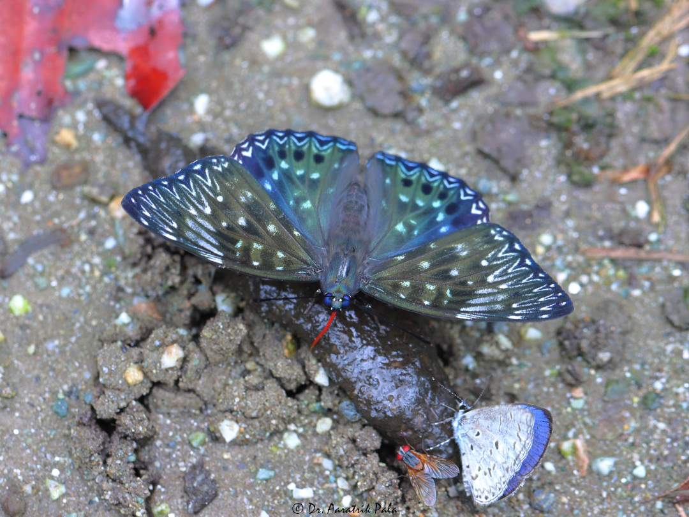

Below, _Dichorragia nesimachus_ and _Celastrina lavendularis_ enjoying a meal, along with an unidentified fly.
<figure>
    
</figure>

A Five-bar swordtail (_Graphium antiphates_) puddling on a riverbed.
<figure>
    
</figure>

_Leptosia nina_ resting on a flower bud.
<figure>
    
</figure>
