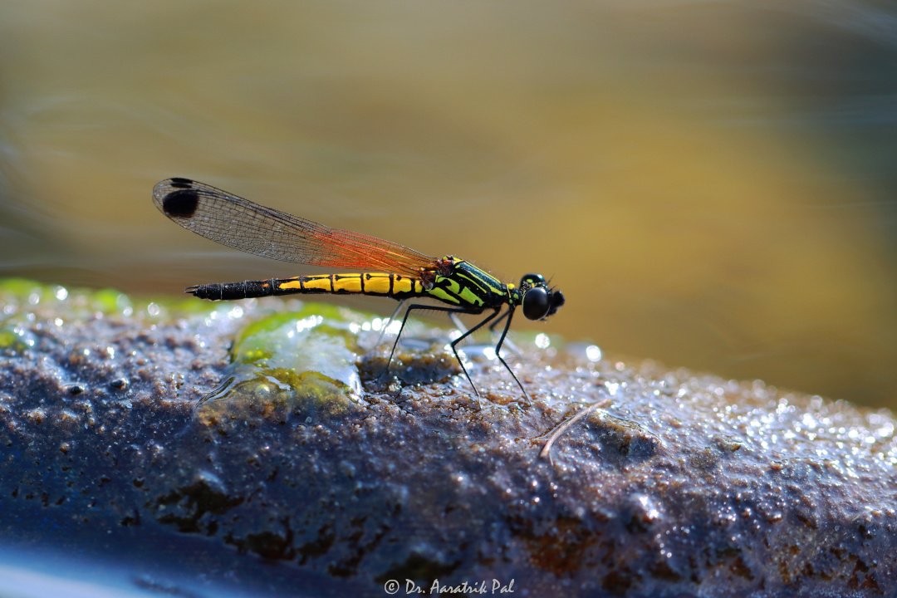

__Welcome!!__

__Natura Himalayas__ is aimed to showcase photographs of some of the not-so-popular biodiversity, from the Himalayas and Himalayan foothills of India. It also deals with the articles on the documentation of these species from the region.

Below is a picture of a blue butterfly, _Cheritra freja_ (Common Imperial), which occupies in the forests and forest edges.

And there are stunning dragonflies and damselflies, too, like a _Libellago lineata_ (as shown below).

---
__Dr. Aaratrik Pal__

__[Natura Himalayas](https://naturahimalayas.github.io)__
---
