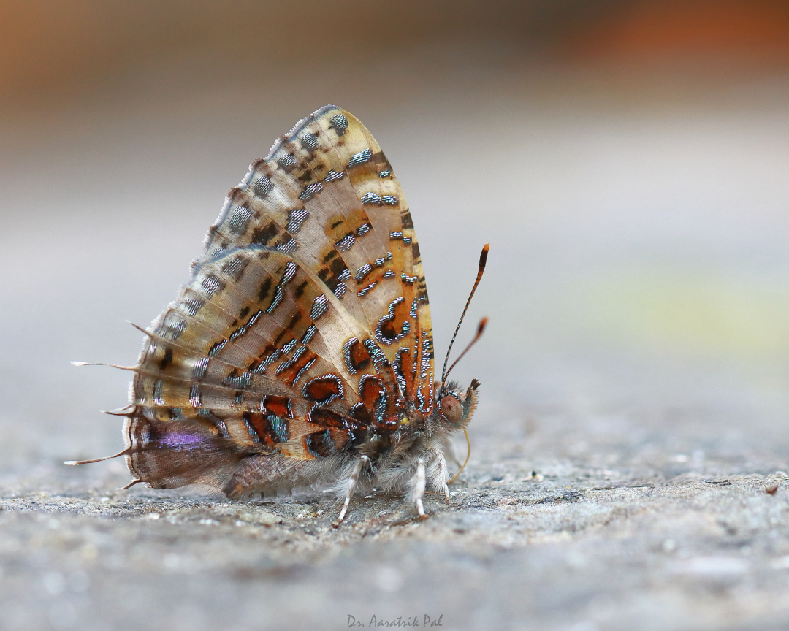

## Welcome!!
__Natura Himalayas__ is aimed to showcase photographs of some of the not-so-popular biodiversity, from the Himalayas and Himalayan foothills of India. It also deals with the articles on the documentation of different species from the region.

Below is a picture of a very common damselfly, _Ischnura rubilio_, which occupies in the grasslands and open habitats.

Butterflies are also among different diverse groups found in the Himalayas, like the Tinsel butterfly (shown below).

